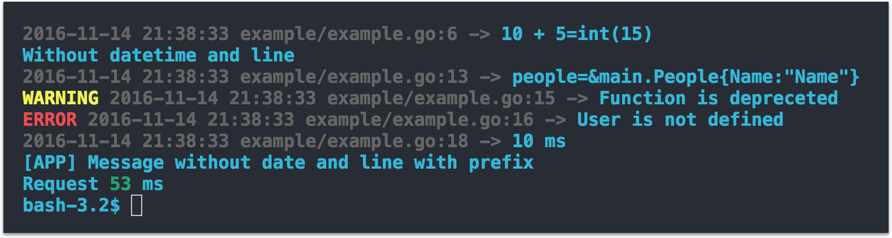

## Golang Pretty Logger


```go
 	l.Log(10 + 5)
	l.Print("Without datetime and code line")

	type People struct {
		Name string
	}
	people := &People{"Name"}
	l.Debug(people)

	l.Warn("Function is depreceted")
	l.Error("User is not defined")

	l.Logf("%d ms", 10)

	l.Printf("Request %s ms", l.Colorize("53", l.Green))

	// Custom logger (useful for plugins)
	var log = l.New()
  log.Prefix = l.Colorize("[APP] ", l.Blue)
	log.Level = l.LevelDebug // default
	log.DisabledInfo = true  // without date and code line

	log.Debug("Message without date and line with prefix")
```
Terminal output:
