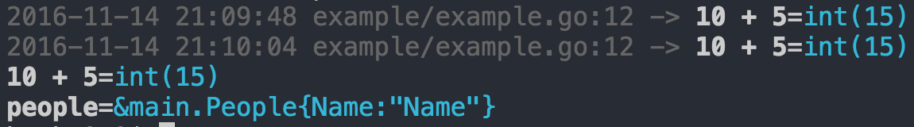

## Golang Pretty Logger

```go
  package main

  import "github.com/happierall/l"

  type People struct {
    Name string
  }

  func main() {
    people := &People{"Name"}

    l.Log(10 + 5)
    l.Print(10 + 5)
    l.Print(people)
  }
```
Terminal output:
